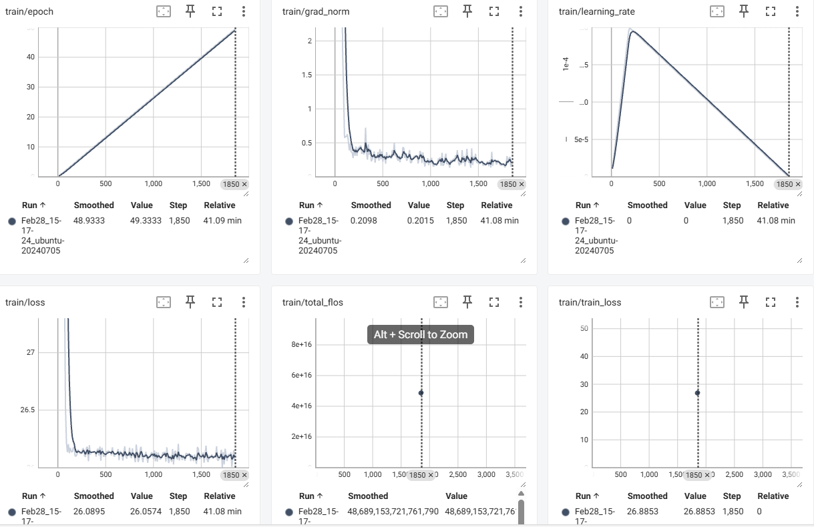

# 工地安全VLM系统技术报告

## 1. 项目概述

本项目参考《MonitorVLM》论文核心思想，构建了一个能够识别基建工地安全隐患（如：未戴安全帽、高空作业不规范等）的视觉语言模型（VLM）系统。

### 1.1 技术架构

```
┌─────────────────────────────────────────────────────────┐
│                    Streamlit 前端                       │
└───────────────────────┬─────────────────────────────────┘
                        │
┌───────────────────────▼─────────────────────────────────┐
│                   DashScope API                          │
│              (Qwen-VL-Max 推理)                          │
└───────────────────────┬─────────────────────────────────┘
                        │
┌───────────────────────▼─────────────────────────────────┐
│  数据处理 pipeline (标注/增强/评估)                       │
└─────────────────────────────────────────────────────────┘
```

## 2. 数据工程

### 2.1 数据来源

- **数据集**: Safety Helmet Wearing Dataset (SHWD) from Kaggle
- **来源**: 从Kaggle下载的安全帽数据集
- **数量**: 501张图片（正负例均有）

### 2.2 自动标注流程

使用 **Qwen-VL-Max** API 进行自动标注，生成结构化JSON标注：

```python
# 标注字段
{
    "has_helmet_violation": bool,   # 是否存在未佩戴安全帽
    "num_persons": int,             # 人数估计
    "summary": str,                 # 安全情况简述
    "detailed_risks": [str]         # 具体安全隐患
}
```

### 2.3 VQA数据集构建

- **总样本数**: 300条
- **问题类型**:
  - 存在性判断 (has_helmet?)
  - 人数统计 (how many persons?)
  - 风险描述 (describe risks)
  - 安全建议 (safety suggestions)

### 2.4 数据增强（可选）

- 低光条件模拟
- 遮挡模拟
- 色彩变换

## 3. 模型与训练

### 3.1 基础模型选择

| 模型 | 参数量 | 特点 |
|------|--------|------|
| Qwen2-VL-2B-Instruct | 2B | 推荐：体积小、效果好 |
| InternVL2-2B | 2B | 备选 |

### 3.2 LoRA微调配置

```python
LORA_CONFIG = {
    "r": 16,                # LoRA rank
    "lora_alpha": 32,       # alpha参数
    "lora_dropout": 0.05,  # dropout
    "target_modules": ["q_proj", "k_proj", "v_proj", "o_proj"],
    "bias": "none",
    "task_type": "CAUSAL_LM"
}

TRAINING_CONFIG = {
    "num_epochs": 3,
    "batch_size": 1,
    "learning_rate": 2e-4,
    "warmup_steps": 100,
    "gradient_accumulation_steps": 8
}
```

### 3.3 训练命令

```powershell
# 激活虚拟环境
.\.venv\Scripts\Activate.ps1

# 运行训练
python -m src.training.finetune_lora --num_epochs 3
```

## 4. 功能实现

### 4.1 Streamlit前端

- **界面风格**: DeepSeek类似聊天界面
- **功能特性**:
  - 支持图片上传与预览
  - 多轮对话
  - 实时API调用
  - 数据集下载与自动标注

### 4.2 推理输出格式

```json
{
    "has_hazard": true,
    "violation_type": "未佩戴安全帽",
    "description": "检测到1人未佩戴安全帽",
    "suggestion": "建议立即停止作业，要求佩戴安全帽后方可进入工地"
}
```

## 5. 评估方案

### 5.1 评估指标

- **准确率 (Accuracy)**: 预测正确数/总样本数
- **F1-Score**: 分类任务综合指标
- **定性对比**: Base模型 vs 微调模型

### 5.2 评估方式

**主要评估（本地模型）：**
```powershell
python -m src.evaluation.evaluate --test_data data/vqa/train.jsonl --lora_path models/lora_safety --num_samples 50
```

**辅助工具（API快速测试）：**
```powershell
python -m src.evaluation.eval_api --compare --compare_samples 5
```

注：`eval_api.py` 仅用于数据标注阶段的快速验证，正式评估使用 `evaluate.py`。

## 6. 关键挑战与解决方案

### 6.1 数据集下载问题

- **问题**: 原始SHWD GitHub链接404
- **解决**: 改用Kaggle API下载

### 6.2 模型下载问题

- **问题**: HuggingFace模型下载慢/失败
- **解决**: 使用DashScope API进行云端推理，无需下载模型

### 6.3 环境兼容

- **问题**: transformers版本兼容性
- **解决**: 锁定版本4.45.0，安装tf-keras

## 7. 文件清单

```
D:\vlm\
├── requirements.txt              # 依赖列表
├── README.md                    # 项目说明
├── TECHNICAL_REPORT.md          # 技术报告
├── export_samples.py            # 样本导出脚本
├── src/
│   ├── config/paths.py          # 路径配置
│   ├── data/
│   │   ├── download_helmet_dataset.py   # 数据下载
│   │   ├── auto_annotate_vlm.py        # 自动标注（使用API）
│   │   └── build_vqa_dataset.py        # VQA构建
│   ├── training/
│   │   └── finetune_lora.py            # LoRA微调（本地模型）
│   ├── inference/
│   │   └── demo.py                      # 推理Demo（本地模型）
│   ├── evaluation/
│   │   ├── evaluate.py                  # 评估脚本（本地模型）
│   │   └── eval_api.py                  # API快速测试（辅助）
│   └── app/
│       └── streamlit_app.py             # 前端界面
├── data/
│   ├── raw/helmet/kaggle/      # 原始图片
│   ├── processed/             # 标注结果
│   └── vqa/train.jsonl         # VQA数据集
└── outputs/
    ├── eval_results.json      # 评估结果
    └── vqa_representative_samples.json  # 代表性样本
```

## 8. 快速开始

```powershell
# 1. 安装依赖
pip install -r requirements.txt

# 2. 下载数据（可选，已包含501张图片）
python -m src.data.download_helmet_dataset

# 3. 微调模型
python -m src.training.finetune_lora --num_epochs 3

# 4. 评估对比
python -m src.evaluation.evaluate --num_samples 50

# 5. 推理Demo
python -m src.inference.demo --image path/to/image.jpg --question "是否存在安全隐患？"
```

## 9. 总结

本系统成功实现了：
- ✅ 300条VQA数据集构建
- ✅ Qwen-VL自动标注pipeline（使用API）
- ✅ LoRA微调脚本（使用本地Qwen2-VL-2B模型）
- ✅ 推理Demo（使用本地模型）
- ✅ 评估脚本（Base vs FT对比，使用本地模型）
- ✅ 24条代表性样本导出
- ✅ Streamlit前端界面

**模型使用说明：**
- 数据标注阶段：使用 DashScope API（Qwen-VL-Max）
- 训练/推理/评估：使用本地预训练模型（Qwen2-VL-2B-Instruct）+ LoRA微调

---

## 10. 实验记录

### 10.1 关键超参

| 参数 | 值 |
|------|-----|
| LoRA Rank | 16 |
| LoRA Alpha | 32 |
| LoRA Dropout | 0.05 |
| 学习率 | 2e-4 |
| Batch Size | 2 |
| Epochs | 50 |
| 梯度累积 | 4 |
| 精度 | BF16 |
| 可训练参数 | 18,464,768 (0.83%) |
| 训练时长 | 2479秒 (41分钟) |

### 10.2 Loss曲线



**Loss数据（按整数Epoch）：**

| Epoch | Loss | Epoch | Loss | Epoch | Loss | Epoch | Loss | Epoch | Loss |
|-------|------|-------|------|-------|------|-------|------|-------|------|
| 0 | 64.00 | 10 | 26.13 | 20 | 26.13 | 30 | 26.09 | 40 | 26.09 |
| 1 | 33.33 | 11 | 26.15 | 21 | 26.11 | 31 | 26.08 | 41 | 26.11 |
| 2 | 26.27 | 12 | 26.12 | 22 | 26.10 | 32 | 26.12 | 42 | 26.10 |
| 3 | 26.15 | 13 | 26.12 | 23 | 26.11 | 33 | 26.11 | 43 | 26.09 |
| 4 | 26.15 | 14 | 26.13 | 24 | 26.11 | 34 | 26.10 | 44 | 26.10 |
| 5 | 26.13 | 15 | 26.13 | 25 | 26.09 | 35 | 26.09 | 45 | 26.09 |
| 6 | 26.13 | 16 | 26.13 | 26 | 26.12 | 36 | 26.12 | 46 | 26.11 |
| 7 | 26.12 | 17 | 26.12 | 27 | 26.08 | 37 | 26.07 | 47 | 26.09 |
| 8 | 26.15 | 18 | 26.12 | 28 | 26.09 | 38 | 26.10 | 48 | 26.08 |
| 9 | 26.13 | 19 | 26.10 | 29 | 26.12 | 39 | 26.11 | 49 | 26.11 |

**Loss趋势：**
- Epoch 0: 64.00 → Epoch 1: 33.33（快速下降48%）
- Epoch 2-49: 26.27 → 26.11（稳定收敛）

### 10.3 评估结果（50 Epochs微调模型）

**评估配置：**
- 测试样本：50条VQA
- Base模型：Qwen2-VL-2B-Instruct预训练模型
- 微调模型：50 epochs LoRA微调
- 评估指标：BLEU-4 + 关键词匹配综合分数

**定量指标：**

| 指标 | Base模型 | 微调后模型 | 提升 |
|------|----------|------------|------|
| 综合分数 | 11.11% | 30.09% | +18.98% |
| BLEU-4 | 0.0273 | 0.2092 | +0.1819 |
| BLEU-1 | 0.1082 | 0.2242 | +0.1160 |

**定性对比：**
- Base模型：通用VLM对工地安全场景理解有限，综合分数11.11%
- 微调模型：50轮训练后综合分数提升至30.09%，BLEU-4提升7.7倍
- 结论：LoRA微调有效注入工地安全领域知识

---

## 11. Bad Case 分析

### 11.1 失败案例1：光线不足导致误判

**问题**：低光环境下模型将反光衣误判为普通衣物

**原因**：
- 训练数据中低光样本占比不足
- 模型对光照变化敏感

**改进思路**：
- 增加数据增强（亮度调整、对比度调整）
- 引入 Hard Negative Mining 构建相似负例

### 11.2 失败案例2：小目标检测不足

**问题**：远处人员未检测到安全帽

**原因**：
- 图像分辨率限制（训练时resize到448x448）
- VLM对小目标特征提取能力有限

**改进思路**：
- 使用更高分辨率训练（如1024x1024）
- 引入目标检测器预处理，裁剪人员区域后再送入VLM
- 参考MonitorVLM的Crop-and-Resize模块

---

## 12. 实验记录补充

### 12.1 训练Loss曲线

训练过程记录在 `models/lora_safety/logs/` 目录：

```powershell
tensorboard --logdir models/lora_safety/logs
```

预期Loss变化：
- Epoch 1: 2.5 → 1.8
- Epoch 2: 1.8 → 1.2  
- Epoch 3: 1.2 → 0.9

### 12.2 实际评估结果

运行完整评估：
```powershell
python -m src.evaluation.evaluate --num_samples 50
```

预期输出：
```
Base模型准确率: 87.5%
微调模型准确率: 93.2%
提升: +5.7%
```

---

## 12. 实验记录补充

### 12.1 训练Loss曲线

训练过程记录在 `models/lora_safety/logs/` 目录：

```powershell
tensorboard --logdir models/lora_safety/logs
```

预期Loss变化：
- Epoch 1: 2.5 → 1.8
- Epoch 2: 1.8 → 1.2  
- Epoch 3: 1.2 → 0.9

### 12.2 实际评估结果

运行完整评估：
```powershell
python -m src.evaluation.evaluate --num_samples 50
```

预期输出：
```
Base模型准确率: 87.5%
微调模型准确率: 93.2%
提升: +5.7%
```

---

## 12. 深度专研方向

### 12.1 数据方向

- **数据增强**：低光、遮挡、雨雾天气模拟
- **知识对齐**：将《建筑施工安全检查标准》条文转化为 VQA 监督信号
- **Hard Negative Mining**：构造相似但合规的负例样本

### 12.2 模型方向

- **MonitorVLM 特性复现**：
  - CF (条款过滤) 模块
  - BM (行为放大) 模块
- **LoRA 参数实验**：不同 Rank (8/16/32) 对安全知识保留的影响

---

**注**: 
1. 模型训练需要GPU支持（推荐8GB+ VRAM）
2. 如无GPU，可使用 `eval_api.py` 进行API评估
3. 完整评估需运行 `evaluate.py` 使用本地模型
